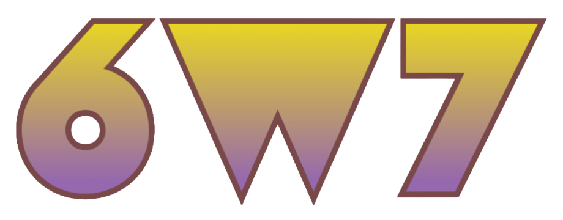

<div align="center">


# 6w7（樂玩ㄑ）- 匿名問答
[](https://6w7.link)
[](#)
[](#)
[](#)
[](#)
[](LICENSE)
[](https://github.com/kkeevin/6w7/stargazers)
[](https://github.com/kkeevin/6w7/forks)

[](https://nextjs.org)
[](https://www.typescriptlang.org)
[](https://tailwindcss.com)
[](https://ui.shadcn.com)
[](https://www.postgresql.org)
[](https://www.prisma.io)
[](https://authjs.dev)
[](https://nodejs.org)

[](https://vercel.com)
[](https://neon.tech)
[](https://upstash.com)
[](https://www.cloudflare.com/developer-platform/r2/)

Next.js 專案，由 Vercel 託管並綁定付費網域；資料庫用 Neon，物件存在 Cloudflare R2。

產生專屬短連結，產生圖卡於限動分享後收匿名提問。(以及更多功能，[詳閱文件](AGENTS.md))

介面支援 **繁體中文**（預設）、**English**、**日本語**、**한국어**；頁尾可切換。
</div>

## 本機啟動

```bash
npm ci
copy .env.example .env
npm run db:deploy
npm run dev
```

先在 `.env` 填 `DATABASE_URL`（PostgreSQL／Neon 或 Docker），再開 http://localhost:3000。其餘必填變數見 `.env.example`；非 Windows 把 `copy` 改成 `cp`。

## 文件

- [產品規格](AGENTS.md)
- [本機與部署概要](docs/INFRA-SETUP.md)
- [密鑰備忘範本](docs/SECRETS.local.example.md)

## 常用指令

```bash
npm run dev          # 開發
npm run build        # prisma generate + next build
npm run lint
npm run db:deploy    # 套用已有 migrations
npm run db:migrate   # 開發時產新 migration
```

## License

[非商業學術教材授權](LICENSE)（**不是** MIT／OSI 開源）。Copyright (c) 2026 KKeevin。

允許下載、學習、改作業與課堂使用；**禁止商用、禁止當成正式對外網站／服務上線**。官方站 [6w7.link](https://6w7.link) 由著作權人自行營運。第三方套件仍依其原授權。

## 小日子：角色造型封測

啟動既有 `npm run dev` 後開啟 `/tools/play`，點「打開造型工作室」。單人換裝不需要另啟遊戲伺服器，也不需要新增資料庫欄位。

- 六種身形、八項身形／肌肉微調、八種膚色、四種臉型、八種髮型與七種鬍型。
- 胸、腹、上臂、前臂、大腿、小腿各自四段體毛密度，可一鍵套用全部部位。
- 上衣、褲子、內褲、鞋、帽、項鍊、身上配件、手持物分層；配件欄目前一次選一件，仍可搭配項鍊、帽子與手持物。衣著與髮毛支援自選色。最低衣著保留三角／四角內褲。
- 正面、背面與斜側預覽共用遊戲角色繪製；角色精靈為 192 × 256，身形變化會同步影響衣物輪廓。
- 外觀存於瀏覽器 `6w7:game:appearance:v2`，自動讀取舊 v1 外觀。調整不重置單人位置與暫存獎勵；工作室可還原本次調整。連線期間先回單人模式再換裝。
- 網路票證只接受 v2 完整外觀，更新時網站與遊戲服務須使用相同版本。這一步未部署 Oracle，也未建立永久角色存檔。

驗證：`npm run game:test`（含外觀白名單、遷移、票證大小與進度保留）、`npx tsc --noEmit`。遊戲常駐服務使用 Node.js 22 以上；本機多人開發指令為 `npm run game:dev`，部署流程另行進行。
